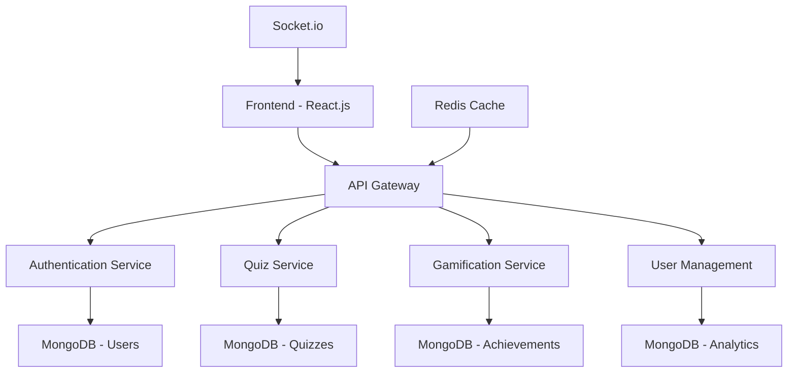

# 🎯 Online Quiz System with Gamification

<div align="center">


[](https://opensource.org/licenses/MIT)
[](https://nodejs.org/)
[](https://reactjs.org/)
[](https://www.mongodb.com/)
[](https://expressjs.com/)

**An engaging, feature-rich online quiz platform with gamification elements to make learning fun and competitive!**

[🚀 Live Demo](https://your-demo-link.com) • [📖 Documentation](https://your-docs-link.com) • [🐛 Report Bug](https://github.com/username/quiz-system/issues) • [💡 Request Feature](https://github.com/username/quiz-system/issues)

</div>

---

## 🌟 Key Features

### 🎮 **Gamification Elements**
- 🏆 **Achievement System** - Unlock badges and trophies
- 🔥 **Streak Tracking** - Maintain daily quiz streaks
- ⭐ **XP & Leveling** - Gain experience points and level up
- 🏅 **Leaderboards** - Global and friends rankings
- 🎁 **Rewards System** - Earn coins and unlock premium content

### 📚 **Quiz Management**
- 📝 **Multiple Question Types** - MCQ, True/False, Fill-in-the-blanks
- ⏱️ **Timed Quizzes** - Configurable time limits
- 🎯 **Difficulty Levels** - Easy, Medium, Hard, Expert
- 📊 **Categories** - Science, History, Sports, Technology, etc.
- 🔄 **Randomized Questions** - Dynamic question ordering

### 👥 **User Experience**
- 🔐 **Secure Authentication** - JWT-based login system
- 👤 **User Profiles** - Customizable avatars and stats
- 📱 **Responsive Design** - Works on all devices
- 🌙 **Dark/Light Mode** - Theme switching
- 🔔 **Real-time Notifications** - Achievement alerts

### 📈 **Analytics & Reporting**
- 📊 **Performance Dashboard** - Detailed statistics
- 📉 **Progress Tracking** - Visual progress indicators
- 🎯 **Accuracy Metrics** - Track improvement over time
- 📋 **Quiz History** - Complete attempt history

---

## 🏗️ Architecture



## 🚀 Quick Start

### Prerequisites

Make sure you have the following installed:
- 📦 **Node.js** (v16 or higher)
- 🍃 **MongoDB** (v5.0 or higher)
- 🔴 **Redis** (v6.0 or higher)
- 📱 **Git**

### 🔧 Installation

1. **Clone the repository**
   ```bash
   git clone https://github.com/username/online-quiz-system.git
   cd online-quiz-system
   ```

2. **Install dependencies**
   ```bash
   # Install server dependencies
   npm install
   
   # Install client dependencies
   cd client
   npm install
   cd ..
   ```

3. **Environment Configuration**
   ```bash
   # Copy environment template
   cp .env.example .env
   
   # Edit environment variables
   nano .env
   ```

4. **Database Setup**
   ```bash
   # Start MongoDB and Redis
   npm run db:start
   
   # Seed database with sample data
   npm run db:seed
   ```

5. **Start the application**
   ```bash
   # Development mode (starts both server and client)
   npm run dev
   
   # Production mode
   npm run build
   npm start
   ```

🎉 **Access the application at:** `http://localhost:3000`

---

## 📋 Environment Variables

Create a `.env` file in the root directory:

```env
# 🔧 Server Configuration
PORT=5000
NODE_ENV=development

# 🗄️ Database Configuration
MONGODB_URI=mongodb://localhost:27017/quiz_system
REDIS_URL=redis://localhost:6379

# 🔐 Authentication
JWT_SECRET=your_super_secret_jwt_key
JWT_EXPIRE=7d

# 📧 Email Configuration (Optional)
EMAIL_HOST=smtp.gmail.com
EMAIL_PORT=587
EMAIL_USER=your-email@gmail.com
EMAIL_PASS=your-app-password

# 🌐 Client Configuration
REACT_APP_API_URL=http://localhost:5000/api
REACT_APP_SOCKET_URL=http://localhost:5000
```

---

## 🎮 Usage Guide

### 👨‍🎓 **For Students**

1. **🔑 Register/Login**
   - Create account with email verification
   - Choose your avatar and customize profile

2. **🎯 Take Quizzes**
   - Browse categories or search for specific topics
   - Select difficulty level and time limit
   - Answer questions and track your score

3. **🏆 Earn Achievements**
   - Complete daily challenges
   - Maintain quiz streaks
   - Unlock badges for milestones

4. **📊 Track Progress**
   - View your dashboard with detailed statistics
   - Compare performance with friends
   - Set personal goals and targets

### 👨‍🏫 **For Instructors**

1. **📝 Create Quizzes**
   - Use the intuitive quiz builder
   - Add multimedia content (images, videos)
   - Set scoring rules and time limits

2. **👥 Manage Students**
   - Create classes and invite students
   - Monitor student progress
   - Generate performance reports

3. **📈 Analytics**
   - View detailed quiz analytics
   - Identify common mistakes
   - Track class performance trends

---

## 🛠️ Tech Stack

### **Frontend**
- ⚛️ **React.js 18** - User interface
- 🎨 **Tailwind CSS** - Styling framework
- 📊 **Chart.js** - Data visualization
- 🔄 **Redux Toolkit** - State management
- 🌐 **Socket.io Client** - Real-time features

### **Backend**
- 🟢 **Node.js** - Runtime environment
- 🚀 **Express.js** - Web framework
- 🍃 **MongoDB** - Primary database
- 🔴 **Redis** - Caching and sessions
- 🔌 **Socket.io** - WebSocket connections

### **Authentication & Security**
- 🔐 **JWT** - JSON Web Tokens
- 🛡️ **bcryptjs** - Password hashing
- 🔒 **Helmet.js** - Security headers
- 🚫 **Rate limiting** - API protection

---

## 📁 Project Structure

```
online-quiz-system/
├── 📁 client/                 # React frontend
│   ├── 📁 public/
│   ├── 📁 src/
│   │   ├── 📁 components/     # Reusable components
│   │   ├── 📁 pages/          # Page components
│   │   ├── 📁 hooks/          # Custom hooks
│   │   ├── 📁 store/          # Redux store
│   │   ├── 📁 utils/          # Utility functions
│   │   └── 📁 styles/         # CSS files
│   └── 📄 package.json
├── 📁 server/                 # Node.js backend
│   ├── 📁 controllers/        # Route controllers
│   ├── 📁 models/             # Database models
│   ├── 📁 routes/             # API routes
│   ├── 📁 middleware/         # Custom middleware
│   ├── 📁 utils/              # Helper functions
│   ├── 📁 config/             # Configuration files
│   └── 📄 server.js           # Entry point
├── 📁 docs/                   # Documentation
├── 📁 tests/                  # Test files
├── 📄 README.md
├── 📄 package.json
└── 📄 .env.example
```

---

## 🧪 Testing

Run the comprehensive test suite:

```bash
# Run all tests
npm test

# Run tests with coverage
npm run test:coverage

# Run specific test suites
npm run test:unit        # Unit tests
npm run test:integration # Integration tests
npm run test:e2e         # End-to-end tests
```

### 📊 Test Coverage Goals
- 🎯 **Unit Tests**: > 90%
- 🔗 **Integration Tests**: > 80%
- 🌐 **E2E Tests**: > 70%

---

## 📚 API Documentation

### 🔐 **Authentication Endpoints**
```
POST   /api/auth/register     # User registration
POST   /api/auth/login        # User login
POST   /api/auth/logout       # User logout
GET    /api/auth/profile      # Get user profile
PUT    /api/auth/profile      # Update user profile
```

### 🎯 **Quiz Endpoints**
```
GET    /api/quizzes           # Get all quizzes
GET    /api/quizzes/:id       # Get specific quiz
POST   /api/quizzes           # Create new quiz
PUT    /api/quizzes/:id       # Update quiz
DELETE /api/quizzes/:id       # Delete quiz
POST   /api/quizzes/:id/attempt # Submit quiz attempt
```

### 🏆 **Gamification Endpoints**
```
GET    /api/achievements      # Get user achievements
GET    /api/leaderboard       # Get leaderboard
POST   /api/achievements/claim # Claim achievement
GET    /api/stats             # Get user statistics
```

📖 **[Full API Documentation](https://your-api-docs-link.com)**

---

## 🤝 Contributing

We welcome contributions! Here's how you can help:

### 🐛 **Bug Reports**
1. Check existing issues first
2. Use the bug report template
3. Include steps to reproduce
4. Add screenshots if helpful

### ✨ **Feature Requests**
1. Check the roadmap
2. Use the feature request template
3. Explain the use case
4. Consider implementation approach

### 💻 **Code Contributions**
1. Fork the repository
2. Create a feature branch
3. Make your changes
4. Add tests for new features
5. Submit a pull request

```bash
# Development workflow
git checkout -b feature/amazing-feature
git commit -m 'Add amazing feature'
git push origin feature/amazing-feature
```

### 📋 **Coding Standards**
- Use ESLint and Prettier
- Follow conventional commits
- Write comprehensive tests
- Update documentation

---

## 📖 Documentation

- 📚 **[User Guide](docs/user-guide.md)** - Complete user manual
- 👨‍💻 **[Developer Guide](docs/developer-guide.md)** - Setup and development
- 🏗️ **[Architecture Guide](docs/architecture.md)** - System design
- 🔌 **[API Reference](docs/api-reference.md)** - Complete API documentation
- 🎨 **[Design System](docs/design-system.md)** - UI/UX guidelines

---

## 🗺️ Roadmap

### 🚀 **Version 2.0** (Q3 2025)
- [ ] 🎮 **Multiplayer Quizzes** - Real-time competitive mode
- [ ] 🤖 **AI-Generated Questions** - Smart question creation
- [ ] 📱 **Mobile App** - Native iOS and Android apps
- [ ] 🔊 **Voice Responses** - Audio question support

### 🎯 **Version 2.1** (Q4 2025)
- [ ] 🌍 **Multi-language Support** - Internationalization
- [ ] 📹 **Video Integration** - YouTube/Vimeo embedding
- [ ] 🏢 **Enterprise Features** - Advanced admin controls
- [ ] 📊 **Advanced Analytics** - ML-powered insights

---

## 🏆 Achievements System

Our gamification system includes various achievement types:

| Achievement | Description | Points | Badge |
|-------------|-------------|---------|-------|
| 🔥 **First Steps** | Complete your first quiz | 10 XP | 🥉 Bronze |
| ⚡ **Speed Demon** | Complete 10 quizzes in under 30 seconds | 50 XP | 🥈 Silver |
| 🎯 **Perfect Score** | Get 100% on any quiz | 25 XP | 🏅 Gold |
| 📚 **Knowledge Seeker** | Complete 100 quizzes | 200 XP | 💎 Diamond |
| 🔥 **Streak Master** | Maintain a 30-day streak | 500 XP | 👑 Legendary |

---

## 📊 Performance Metrics

### 🚀 **System Performance**
- ⚡ **Response Time**: < 200ms average
- 🔄 **Uptime**: 99.9% availability
- 👥 **Concurrent Users**: Supports 10,000+
- 💽 **Database**: Optimized for 1M+ questions

### 📱 **User Experience**
- 📊 **Accessibility**: WCAG 2.1 AA compliant
- 🌐 **Browser Support**: Chrome, Firefox, Safari, Edge
- 📱 **Mobile Responsive**: iOS 12+, Android 8+
- ⚡ **Loading Speed**: < 3 seconds initial load

---

## 🛡️ Security

### 🔐 **Security Features**
- 🛡️ **Data Encryption** - TLS 1.3 in transit, AES-256 at rest
- 🔑 **Authentication** - Multi-factor authentication support
- 🚫 **Rate Limiting** - Prevents abuse and DDoS
- 🔍 **Input Validation** - Prevents injection attacks
- 📊 **Audit Logging** - Complete activity tracking

### 🚨 **Security Reporting**
Found a security vulnerability? Please email security@yourcompany.com

---

## 📞 Support

### 💬 **Community Support**
- 💬 **[Discord Server](https://discord.gg/yourserver)** - Live chat support
- 📧 **[Discussions](https://github.com/username/quiz-system/discussions)** - GitHub discussions
- 📚 **[Stack Overflow](https://stackoverflow.com/questions/tagged/quiz-system)** - Technical questions

### 🎫 **Professional Support**
- 📧 **Email**: support@yourcompany.com
- 📞 **Phone**: +1 (555) 123-4567
- 🕒 **Hours**: Mon-Fri, 9 AM - 6 PM PST

---

## 📄 License

This project is licensed under the **MIT License** - see the [LICENSE](LICENSE) file for details.

```
MIT License

Copyright (c) 2025 Your Company Name

Permission is hereby granted, free of charge, to any person obtaining a copy
of this software and associated documentation files (the "Software"), to deal
in the Software without restriction, including without limitation the rights
to use, copy, modify, merge, publish, distribute, sublicense, and/or sell
copies of the Software, and to permit persons to whom the Software is
furnished to do so, subject to the following conditions:

The above copyright notice and this permission notice shall be included in all
copies or substantial portions of the Software.
```

---

## 🙏 Acknowledgments

Special thanks to our contributors and the open-source community:

- 🎨 **Design Inspiration**: [Dribbble](https://dribbble.com)
- 🖼️ **Icons**: [Lucide Icons](https://lucide.dev)
- 🎨 **Illustrations**: [Undraw](https://undraw.co)
- 📊 **Charts**: [Chart.js](https://www.chartjs.org)
- 🚀 **Hosting**: [Vercel](https://vercel.com) & [Railway](https://railway.app)

---

## 📈 Stats

<div align="center">


**⭐ Star this repository if you found it helpful!**

Made with ❤️ by [Your Team Name](https://yourcompany.com)

</div>

---

<div align="center">

**[🔝 Back to Top](#-online-quiz-system-with-gamification)**

</div>